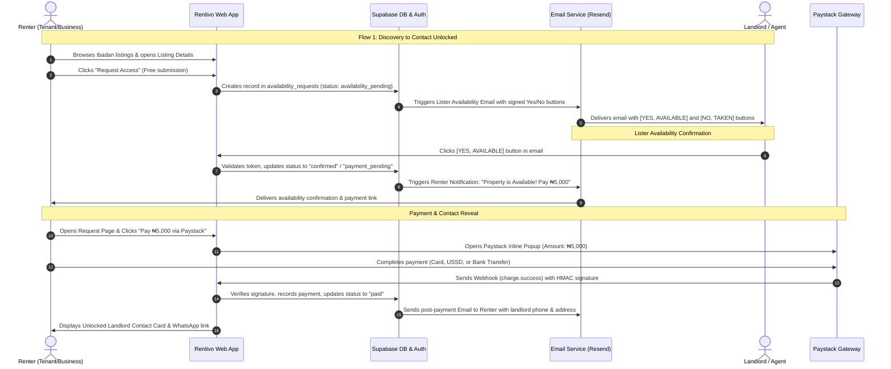

# Rentivo — App Flow, Complete Page Inventory and User Flows

**Version:** 2.0 MVP Build Specification  
**Tech Stack Alignment:** Supabase (Database & Auth), ImageKit (Photos), Paystack (Payments), Email-Only Notifications (Resend/SMTP)  
**Launch Market:** Ibadan, Nigeria  

---

## 1. Complete Page & View Inventory

The Rentivo web application contains **28 distinct pages, dashboards, and views** organized into five operational areas plus tokenized action endpoints:

| # | Route | Audience | Page Name | Primary Function |
|---|---|---|---|---|
| **1** | `/` | Public | Home Landing Page | High-conversion marketplace entry, search bar, value props, verified listing highlights |
| **2** | `/search` | Public | Search & Browse Marketplace | Advanced property filters, responsive card grid, price sorting, area selection |
| **3** | `/listings/:id` | Public | Property Detail Page | Full ImageKit gallery, specs, amenities, inspection badge, Request Access CTA |
| **4** | `/how-it-works` | Public | How It Works & Fee Guide | Clear guide to verified listings, ₦5,000 post-confirmation fee, and zero agent gouging |
| **5** | `/terms` | Public | Terms of Service | Legal terms, marketplace disclaimers, usage guidelines |
| **6** | `/privacy` | Public | Privacy Policy | NDPR compliance, data handling, and contact protection policies |
| **7** | `/access-fee-terms` | Public | Access Fee Policy | Explanation of flat ₦5,000 fee, refund policies, and non-guarantee disclosures |
| **8** | `/login` | Public | Sign In Page | Supabase Auth login with email/password or magic link |
| **9** | `/signup` | Public | Sign Up & Role Selection | User registration with role choice (Tenant, Business Renter, Landlord, Agent) |
| **10** | `/forgot-password` | Public | Password Recovery | Supabase password reset link dispatch |
| **11** | `/reset-password` | Authenticated | Set New Password | Password reset form triggered via Supabase auth email link |
| **12** | `/auth/callback` | Public | Auth Callback Handler | Processing email confirmation tokens and redirects |
| **13** | `/account` | Renter | Renter Dashboard Overview | Summary of active requests, saved properties, and profile shortcuts |
| **14** | `/account/requests` | Renter | My Requests History | Live status tracker of all submitted access requests |
| **15** | `/requests/:id` | Renter | Request Status & Paystack Checkout | Live status updates, Paystack ₦5,000 payment button, and unlocked contact details |
| **16** | `/account/favorites` | Renter | Saved Listings | Bookmarked properties for quick reference |
| **17** | `/account/profile` | Renter | Profile & Contact Settings | Managing full name, phone number, and notification email preferences |
| **18** | `/lister` | Lister | Lister Dashboard | Overview of active listings, access request inquiries, views, and verification count |
| **19** | `/lister/listings` | Lister | My Properties | Table/cards of all owned listings (Active, Draft, Unavailable, Suspended) |
| **20** | `/lister/listings/new` | Lister | Create Listing Wizard | Multi-step property submission with ImageKit direct multi-photo upload |
| **21** | `/lister/listings/:id/edit` | Lister | Edit Property | Updating descriptions, prices, photos, and availability status |
| **22** | `/lister/verification` | Lister | Verification & Inspections | Requesting physical property inspection for the Verified badge |
| **23** | `/lister/requests` | Lister | Incoming Renter Inquiries | In-app view to verify availability if email was missed |
| **24** | `/admin` | Admin | Admin Overview & Analytics | Platform KPIs, active listings count, revenue totals, pending queue counters |
| **25** | `/admin/listings` | Admin | Listing Moderation Queue | Reviewing, approving, suspending, or removing flagged listings |
| **26** | `/admin/verification` | Admin | Inspection Dispatch Queue | Assigning inspectors, completing inspection checklists, awarding Verified badges |
| **27** | `/admin/escalations` | Admin | Availability Escalations Queue | Managing requests where listers failed to respond within operational window |
| **28** | `/admin/payments` | Admin | Paystack Transactions & Ledger | Viewing ₦5,000 access fee transactions, refunds, and promo waivers |
| **29** | `/admin/reports` | Admin | Listing Reports Queue | Investigating user complaints on fake listings or bad landlords |
| **30** | `/admin/locations` | Admin | Cities & Neighborhoods Config | Managing cities (Ibadan) and neighborhood areas (Bodija, Akobo, etc.) |
| **31** | `/availability/action` | Public/Token | Email Availability Action Handler | Web landing page confirming lister's one-click YES or NO from email |

---

## 2. Detailed Page Specifications & Functions

---

### Page 1: Home Landing Page (`/`)
- **Audience:** Public / Everyone
- **Purpose:** Introduce the Rentivo value proposition (verified rentals in Ibadan without agent exploitation) and drive immediate search.
- **Key Sections:**
  1. **Hero Section:** Headline ("Find Verified Rentals in Ibadan Without Inflated Agent Fees"), location-centric search bar (Area, Category, Property Type, Max Budget), and quick filter chips.
  2. **Trust & Verification Banner:** Explains physical inspection verification and the flat ₦5,000 fee payable only after confirmation.
  3. **Verified Properties Carousel/Grid:** Curated active listings bearing the green Verified badge.
  4. **Commercial vs. Residential Switcher:** Quick filter for residential flats/houses vs. commercial shops/office spaces.
  5. **Value Proposition Highlights:** Zero upfront agent fee, verified physical visits, fast automated confirmation.
  6. **Neighborhood Highlights:** Bodija, Ring Road, Oluyole, Akobo, UI/Samonda, Jericho.
  7. **Footer:** Brand logo, quick links, terms, privacy, and lister onboarding link.
- **User Actions:** Search with filters -> navigate to `/search`; click listing card -> navigate to `/listings/:id`; click "Post a Listing" -> navigate to `/signup?role=landlord`.

---

### Page 2: Search & Browse Marketplace (`/search`)
- **Audience:** Public / Everyone
- **Purpose:** Allow users to search, filter, and discover available rental listings in Ibadan.
- **Key Components:**
  1. **Filter Sidebar / Mobile Modal:**
     - City: Locked to Ibadan (data-driven from Supabase `cities`).
     - Area: Multi-select dropdown (Bodija, Ring Road, Akobo, UI Area, etc.).
     - Category: All / Residential / Commercial.
     - Property Type: Self-Contain, Flat/Apartment, Duplex, Shop, Office Space, etc.
     - Price Range Slider: Min/Max price per year/month.
     - Verified Only Toggle: Switch to show only listings with `is_verified = true`.
     - Bedrooms / Bathrooms: Count filters.
  2. **Results Header:** Active filter chips, listing count, sort dropdown (Newest First, Price Low to High, Price High to Low).
  3. **Listing Cards Grid:**
     - Primary photo rendered via ImageKit transformation (`tr=w-500,h-350,fo-auto,q-80,f-auto`).
     - Verified badge (green checkmark shield).
     - Price prominently displayed in Naira (e.g., `₦650,000/yr`).
     - Property title, area, bedrooms/bathrooms count.
     - Quick Favorite button (heart icon).
  4. **Pagination / Infinite Scroll.**
  5. **Empty State:** "No properties match your filters. Try clearing some filters or searching adjacent neighborhoods."

---

### Page 3: Property Detail Page (`/listings/:id`)
- **Audience:** Public / Everyone
- **Purpose:** Full property showcase with all necessary information to make a decision and request access.
- **Key Components:**
  1. **ImageKit Photo Gallery:** Large primary image with thumbnail strip, fullscreen lightbox mode, and responsive srcset.
  2. **Property Header:** Title, neighborhood area, property type, price per billing period, and Verified badge.
  3. **Verification Inspection Box (If Verified):** Physical inspection date, certified checklist points (Physical visit completed, address verified, ownership/mandate confirmed).
  4. **Key Features & Amenities:** Grid of icons (Running Water, Pre-paid Meter, Fenced Compound, Pop Ceiling, Security Guard, Parking Space, etc.).
  5. **Description:** Formatted text detailing lease conditions, payment terms, and surroundings.
  6. **Approximate Location Guide:** Public area description (exact address is kept private until payment).
  7. **Lister Trust Signals:** Member since date, number of active listings, response rate indicator.
  8. **Sticky Action Bar / Modal Trigger (Desktop & Mobile):**
     - Primary Button: `Request Access (Free to check)`
     - Fee Disclaimer: "₦5,000 access fee is charged only after availability is confirmed."
  9. **Report Listing Link:** Triggers modal to report suspicious or fake listings.
- **User Actions:** Click "Request Access":
  - If unauthenticated -> redirects to `/login?redirect=/listings/:id`.
  - If authenticated -> opens Confirmation Modal -> creates record in `availability_requests` -> redirects to `/requests/:id`.

---

### Page 4: How It Works & Fee Guide (`/how-it-works`)
- **Audience:** Public / Everyone
- **Purpose:** Educate users on the Rentivo model, eliminating confusion around agent fees and inspections.
- **Key Sections:**
  - The 3-Step Renter Process: 1. Browse Free -> 2. Request Access Free -> 3. Pay Flat ₦5,000 Only Once Confirmed Available.
  - The Physical Inspection Process: How our local Ibadan inspectors verify titles, structures, and landlords.
  - Paystack Security: Secure card/bank transfer processing with instant contact reveal.
  - Frequently Asked Questions (FAQs).

---

### Page 8 & 9: Sign In (`/login`) & Sign Up (`/signup`)
- **Audience:** Public
- **Purpose:** Authentication via Supabase Auth.
- **Key Components:**
  - Role Selection during Signup:
    - Renter: "Looking for a home or commercial space" (`tenant` or `business_renter`).
    - Property Lister: "I have property to rent" (`landlord` or `agent`).
  - Fields: Full Name, Email, Phone Number, Password.
  - Links: Forgot Password, Social Auth (Google if enabled), Back to Browse.
  - Post-Auth Redirection: Redirects to previous intent (e.g. back to `/listings/:id` to complete request).

---

### Page 14: My Requests History (`/account/requests`)
- **Audience:** Authenticated Renter
- **Purpose:** Unified dashboard tracking all submitted property access requests.
- **Key Components:**
  - Request Status Tabs: All, Checking Availability, Ready for Payment, Unlocked Contacts, Unavailable.
  - Request Item Card:
    - Property ImageKit thumbnail, title, area, rental price.
    - Real-time Status Badge:
      - `Checking Availability` (Yellow)
      - `Available — Payment Pending` (Blue CTA: "Pay ₦5,000")
      - `Contact Unlocked` (Green CTA: "View Landlord Details")
      - `Unavailable / Rented` (Gray)
      - `Under Escalation` (Orange)
    - Action button linking directly to `/requests/:id`.

---

### Page 15: Request Status & Paystack Checkout (`/requests/:id`)
- **Audience:** Authenticated Renter (Owner of Request)
- **Purpose:** Dynamic state-driven page handling availability waiting, Paystack payment trigger, and contact reveal.
- **States:**
  1. **State: `availability_pending`:**
     - Animated progress indicator: "We are currently checking availability with the landlord."
     - Explanatory copy: "An email has been sent to the property owner. You will receive an email as soon as they confirm. No money is charged right now."
  2. **State: `confirmed` / `payment_pending`:**
     - Success alert: "Good news! The landlord confirmed this property is available."
     - Fee Breakdown Card: Access Fee = ₦5,000. (Zero hidden agent commissions).
     - Primary Button: `Pay ₦5,000 via Paystack`.
     - Paystack Inline Integration: Launches popup modal with Paystack payment channels.
  3. **State: `paid` (Contact Unlocked):**
     - Success Badge: "Landlord Contact Unlocked & Sent to Your Email."
     - Contact Card:
       - Landlord/Agent Full Name & Agency.
       - Phone Number (with direct `tel:` link).
       - WhatsApp Quick Chat Button (`https://wa.me/...`).
       - Full Exact Address & Directions.
       - Inspection Checklist & Inspector Notes.
  4. **State: `unavailable`:**
     - Notice: "The landlord indicated this property has been rented or is no longer available."
     - Reassurance: "You were not charged anything."
     - Recommendations: Curated carousel of 3 similar verified properties in the same area.

---

### Page 18: Lister Dashboard Overview (`/lister`)
- **Audience:** Landlords & Agents
- **Purpose:** Command center for property owners to monitor their portfolio and incoming leads.
- **Key Metrics:**
  - Total Active Listings.
  - Verified Listings Count.
  - Total Access Requests Received.
  - Availability Response Rate (%).
- **Quick Actions:** "Post New Property", "Request Physical Inspection", "Review Inquiries".

---

### Page 20: Create Listing Wizard (`/lister/listings/new`)
- **Audience:** Landlords & Agents
- **Purpose:** Intuitive form for posting a new rental property.
- **Steps:**
  1. **Category & Type:** Residential vs Commercial; Self-Contain, Flat, Duplex, Shop, Office.
  2. **Location:** City (Ibadan), Neighborhood Area (dropdown from Supabase `areas`), Public Landmark/Summary, and Private Exact Street Address.
  3. **Pricing & Terms:** Rent amount in Naira, Billing period (per year / per month), Caution/Service charge notes.
  4. **Property Details:** Bedrooms, Bathrooms, Size in Sqm, Amenities checkboxes.
  5. **ImageKit Multi-Photo Uploader:**
     - Minimum 3 photos required, maximum 10.
     - Direct client upload to ImageKit with live upload progress bar.
     - Reordering via drag-and-drop.
     - Primary photo selector (sets featured thumbnail).
  6. **Preview & Submit for Review:** 
     - Review listing details.
     - **Pre-Publish Policy:** Newly submitted posts are created in `status = 'pending_approval'` with `is_approved = false`.
     - **Visibility Notice:** "Your property has been submitted for admin verification. It will NOT appear on the public marketplace until approved by our team."
     - Clicks `Submit for Admin Approval`.

---

### Page 22: Physical Verification Request (`/lister/verification`)
- **Audience:** Landlords & Agents
- **Purpose:** Request an on-site visit by an official Rentivo inspector to earn the Verified badge.
- **Form:** Select listing, preferred inspection date, site contact person name & phone number, optional proof of ownership/mandate upload.
- **Status Tracker:** Scheduled -> Inspector Assigned -> Inspection Completed -> Badge Awarded / Action Required.

---

### Pages 24–30: Admin Operations Portal (`/admin/*`)
- **Audience:** Admins & Operations Team
- **Key Views:**
  1. **Admin Dashboard (`/admin`):** Live platform metrics, pending post approval counter, ₦5,000 fees collected via Paystack, open escalation count, pending inspection count.
  2. **Listing Moderation Queue (`/admin/listings`):** 
     - **Mandatory Pre-Publish Gatekeeper:** All newly submitted listings from landlords and agents land here.
     - **Admin Verification Actions:** Admin verifies photos, pricing reasonableness, description authenticity, and address format.
     - `[ Approve & Publish ]`: Sets `status = 'active'` and `is_approved = true`. The property instantly goes live on `/` and `/search`.
     - `[ Reject Listing ]`: Prompts for reason (e.g., blurry photos, suspicious pricing), notifies lister via email, sets `status = 'rejected'`.
  3. **Inspection Queue (`/admin/verification`):** View pending inspection requests, assign inspectors in Ibadan, fill digital checklist (Physical visit, title check, mandate, photo match), and click `Approve Verification` or `Reject`.
  4. **Availability Escalations (`/admin/escalations`):** Real-time list of access requests where the lister hasn't clicked YES/NO in their email within the response window. Admin can call the landlord directly, manually mark Available or Unavailable, or notify renter.
  5. **Payments Ledger (`/admin/payments`):** Audit log of all Paystack transactions, payment references, renter details, and webhook verification statuses.
  6. **Reports Queue (`/admin/reports`):** Review user complaints on fake listings, incorrect pricing, or stale availability.
  7. **Locations Manager (`/admin/locations`):** Add or edit cities and neighborhood areas in Ibadan.

---

### Page 31: Email Availability Action Handler (`/availability/action`)
- **Audience:** Landlords/Agents clicking one-click link in their email
- **Purpose:** Secure public landing view that processes the signed JWT token when a lister clicks `[ YES, STILL AVAILABLE ]` or `[ NO, ALREADY TAKEN ]` directly inside their email client.
- **Behavior:**
  - Verifies HMAC token signature and expiration.
  - If valid: Updates `availability_requests` table to `confirmed` or `unavailable`.
  - Dispatches corresponding email to the renter.
  - Displays a clean, mobile-optimized confirmation screen: "Thank you! You've confirmed [Property Title] is available. The renter has been notified to unlock your contact."

---

## 3. Comprehensive End-to-End User Flows



---

### Flow 1: Renter Discovery to Contact Unlocked (Step-by-Step)
1. **Search & Selection:** Renter visits `/` or `/search`, filters for 2-bedroom flats in Bodija under ₦800,000, and filters by `Verified Only`.
2. **Review Details:** Renter clicks a listing to view `/listings/:id`. Photos load via ImageKit CDN; inspection checklist confirms physical verification.
3. **Submit Free Request:** Renter clicks "Request Access". If logged in, the request is created with status `availability_pending`. No money is charged.
4. **Automated Lister Email:** An email is sent to the lister containing property summary and two one-click buttons.
5. **Lister Confirmation:** Lister clicks `[ YES, IT'S STILL AVAILABLE ]`.
6. **Renter Notification:** Renter receives an email alert and can view `/requests/:id` where status is now `payment_pending`.
7. **Paystack Checkout:** Renter clicks "Pay ₦5,000". Paystack popup opens. Renter pays.
8. **Instant Contact Reveal:** Paystack webhook verifies payment. Request transitions to `paid`.
   - The web app displays the Landlord Contact Card (Name, direct phone, WhatsApp link, full address).
   - An instant email receipt is delivered to the renter with all landlord details and inspection notes.

---

### Flow 2: Lister Property Creation & Admin Verification Gate (Step-by-Step)
1. **Lister Signup:** Landlord or Agent registers at `/signup?role=landlord`.
2. **Access Creation Wizard:** Navigates to `/lister/listings/new`.
3. **Upload Photos via ImageKit:**
   - Lister drags 5 property photos into the upload dropzone.
   - Frontend requests HMAC auth token from `/api/imagekit/auth`.
   - Files upload directly to ImageKit; URLs and file IDs are returned and saved to `listing_photos`.
4. **Submit for Admin Approval:** Lister fills out price, room specs, and location, then clicks "Submit for Review". The listing is saved with `status = 'pending_approval'` and `is_approved = false`.
5. **Pre-Publish Gate (Hidden from Public):** The listing is **NOT visible** on `/search` or `/` and cannot be accessed by public users. In the lister's own dashboard, it displays an orange "Under Review" badge.
6. **Admin Moderation & Approval:** Admin reviews the submission in `/admin/listings`. Once verified, admin clicks "Approve & Publish". Status changes to `active` and `is_approved = true`. The property is now publicly live.
7. **Optional Physical Inspection:** From `/lister/verification`, lister can additionally request an on-site inspection for the listing.
8. **Admin Dispatch & On-Site Inspection:** Admin assigns an Ibadan inspector who visits the property, validates title/mandate, and checks off criteria.
9. **Verified Badge Awarded:** Admin approves inspection checklist. The listing earns the prominent green **Verified Badge** across the marketplace.

---

### Flow 3: Email-Based Lister Availability Confirmation Loop
```
[Renter Submits Request]
           │
           ▼
[System Generates Signed Action Token]
           │
           ▼
[Email Dispatched to Lister via Resend]
           │
     ┌─────┴────────────────────────────────┐
     ▼                                      ▼
[Lister Clicks "YES"]               [Lister Clicks "NO"]
     │                                      │
     ▼                                      ▼
[Token Verified at /availability/action]  [Token Verified at /availability/action]
     │                                      │
     ▼                                      ▼
[Status -> confirmed]                  [Status -> unavailable]
     │                                      │
     ▼                                      ▼
[Email Renter: "Available! Pay ₦5k"]   [Email Renter: "Unavailable, No Charge"]
```

---

### Flow 4: Escalation Workflow (Timeout to Admin Queue)
1. If a lister does not click YES or NO within the operational window (e.g. 2 hours):
2. A scheduled cron job queries `availability_requests` for expired unconfirmed requests.
3. The request status is set to `manual_escalation`.
4. The request surfaces in the **Admin Escalations Queue** (`/admin/escalations`).
5. An operations agent calls the lister's phone directly to check availability.
6. Admin clicks "Confirm Available" or "Mark Unavailable" directly inside the admin panel.
7. The appropriate email notification is triggered to the renter.

---

### Flow 5: First-100-Users Fee Waiver Promo Flow
1. Eligible early renters qualify for the first-100-users launch promotion.
2. When the property is confirmed available, the system checks `promotion_redemptions` count.
3. If cap is not reached: the ₦5,000 fee is automatically waived.
4. Request status transitions directly from `confirmed` to `paid` with `promotion_redemptions` record created.
5. Landlord contact details are immediately unlocked on screen and sent via email without requiring Paystack payment.

---

## 4. Navigation & Layout Architecture

### 4.1 Header Navigation
- **Public / Unauthenticated:**
  - Left: Rentivo Brand Lockup (Logo + Wordmark).
  - Center: Browse Properties, How It Works.
  - Right: "Post a Listing" (Navy border button), "Sign In" (Text link), "Find a Home" (Lavender CTA).
- **Authenticated Renter:**
  - Left: Rentivo Logo.
  - Center: Browse, Saved Listings (with badge count), My Requests.
  - Right: User Avatar Dropdown (My Requests, Saved Listings, Profile Settings, Sign Out).
- **Authenticated Lister:**
  - Left: Rentivo Logo + "Lister Center" badge.
  - Center: Dashboard, My Listings, Inquiries, Verification.
  - Right: "Post New Listing" (+ icon button), Lister Profile, Sign Out.
- **Admin:**
  - Left: Rentivo Admin Portal.
  - Center/Sidebar: Overview, Moderation, Inspections, Escalations, Payments, Reports, Locations.
  - Right: Admin Profile, Sign Out.

### 4.2 Mobile Bottom Navigation Bar (Renters & Public)
- For screens < 768px:
  - **Explore** (Search magnifying glass icon)
  - **Saved** (Heart icon)
  - **Requests** (Clipboard icon with pending badge)
  - **Post** (Plus circle icon)
  - **Account** (User icon)
